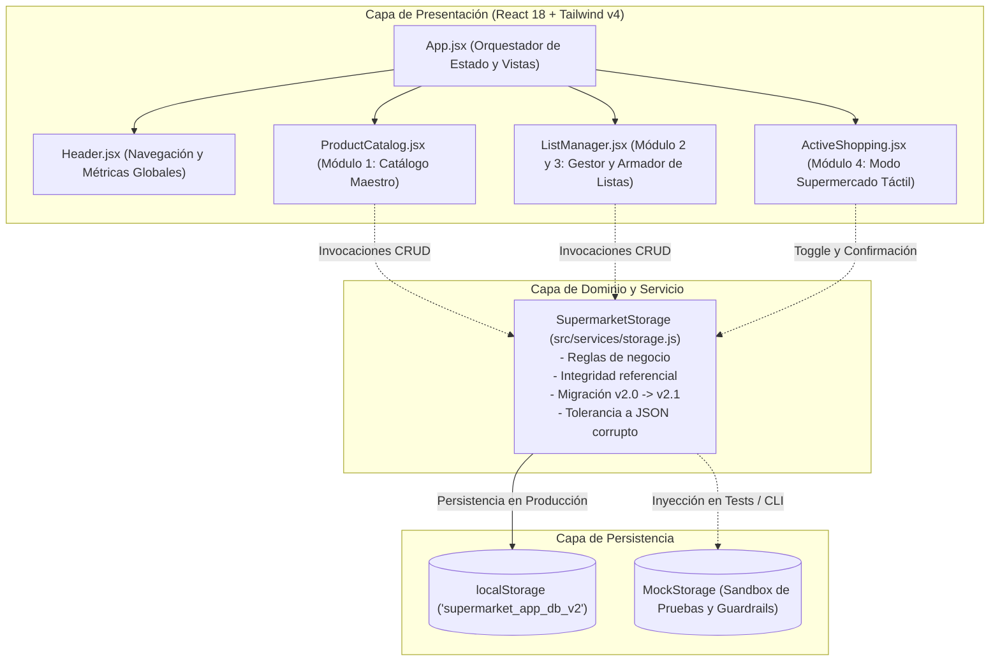
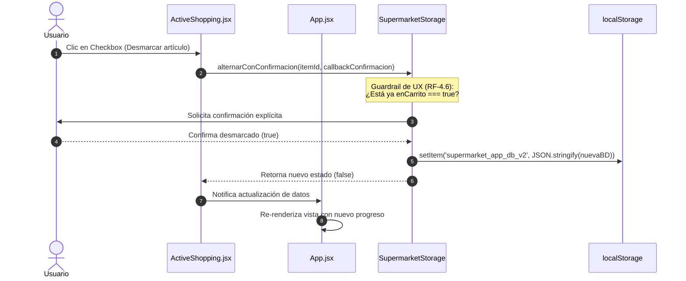
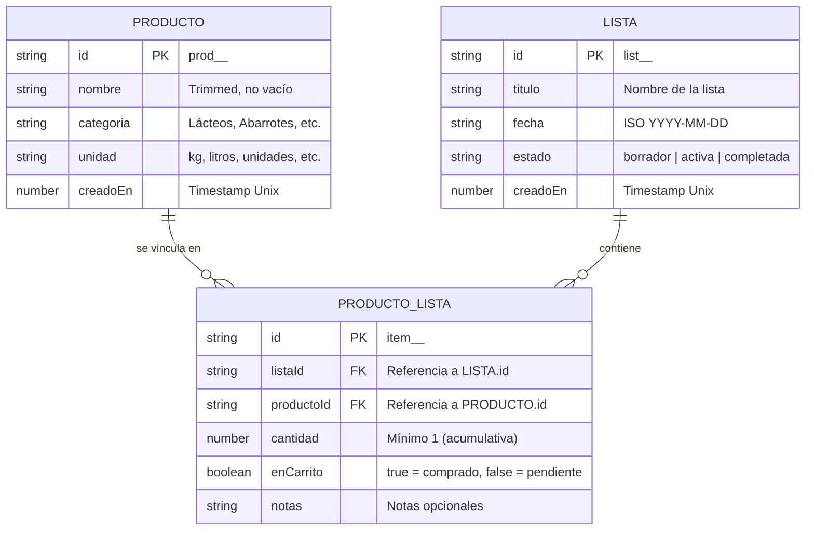

# ARCHITECTURE.md - Arquitectura del Sistema SuperCart (SDD)

> **Documento:** `docs/ARCHITECTURE.md`  
> **Versión:** 1.0.0  
> **Estado:** Aprobado  
> **Alineación:** Conforme a [`docs/SPEC.md`](SPEC.md) v2.12.0

---

## 🏛️ 1. Visión General del Sistema

SuperCart es una Single Page Application (SPA) modular y reactiva diseñada para optimizar la planificación y ejecución de compras de supermercado. Su núcleo arquitectónico se basa en el **desacoplamiento total entre el catálogo maestro y las listas de compra**, operando localmente mediante una base de datos relacional simulada sobre `localStorage` con alta tolerancia a fallos.

---

## 🧩 2. Arquitectura de Componentes y Capas

El sistema está estructurado en 3 capas desacopladas con flujo unidireccional:



---

## 🔄 3. Flujo de Datos Unidireccional y Reactivo

Toda mutación de datos sigue un ciclo determinista y sincrónico:



---

## 🗄️ 4. Modelo de Datos Relacional

El esquema relacional desacopla la despensa general de las listas puntuales a través de una entidad intermedia asociativa:



### Reglas de Integridad Referencial:
1. **Borrado en Cascada ([RF-2.4](SPEC.md#L87)):** Al eliminar una `Lista`, se destruyen automáticamente todos sus registros asociados en `productos_listas`.
2. **Preservación ante Desincorporación ([RF-1.3](SPEC.md#L80)):** Si un `Producto` maestro se elimina, las listas existentes preservan sus ítems con valores de salvaguarda sin provocar excepciones de referencia nula.
3. **Acumulación de Cantidad ([RF-3.2](SPEC.md#L91)):** Si se intenta vincular un producto ya existente en la lista, no se duplica el registro; se incrementa la propiedad `cantidad`.

---

## 🛡️ 5. Resiliencia, Tolerancia a Fallos y Migración

```mermaid
flowchart TD
    START([Inicio obtenerBaseDeDatos]) --> CHECK_STORE{¿Existe valor en storage?}
    CHECK_STORE -- No --> SEED[Sembrar datos de demostración en español - RNF-04]
    CHECK_STORE -- Sí --> PARSE[Parsear JSON]
    
    PARSE --> VALID_JSON{¿JSON válido?}
    VALID_JSON -- Fallo (Corrupto) --> SAFE_RESET[Inicializar tablas limpias [] - RNF-02]
    
    VALID_JSON -- Éxito --> CHECK_LEGACY{¿Contiene claves en inglés?<br/>products / lists / items}
    CHECK_LEGACY -- Sí --> MIGRATE[Migración automática al vuelo v2.0 -> v2.1 - RNF-03]
    CHECK_LEGACY -- No --> RETURN[Retornar base de datos en español v2.2]
    
    MIGRATE --> SAVE_MIGRATED[Guardar estructura migrada] --> RETURN
    SAFE_RESET --> RETURN
    SEED --> RETURN
```

---

## 🧪 6. Estrategia de Pruebas y Guardrails

El sistema cuenta con dos mecanismos de verificación complementarios:

1. **Arnés Visual en Navegador ([tests/harness.html](file:///c:/xampp/htdocs/Antigravity-sdd/app/tests/harness.html)):**
   - Ejecuta las 7 pruebas agrupadas por sección con interfaz interactiva, métricas en vivo y botón de re-ejecución.
2. **Guardrail Script CLI en Node.js ([scripts/guardrails.js](file:///c:/xampp/htdocs/Antigravity-sdd/app/scripts/guardrails.js)):**
   - Se ejecuta mediante `npm run check:guardrails` o `npm test`.
   - Inspecciona estáticamente los archivos contra violaciones de dominio y estilo.
   - Ejecuta de forma *headless* las aserciones del arnés en memoria.
   - Actúa como compuerta de paso en CI/CD y ganchos pre-commit.
