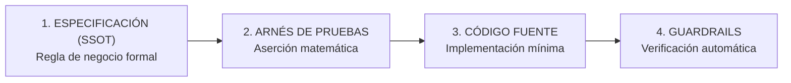
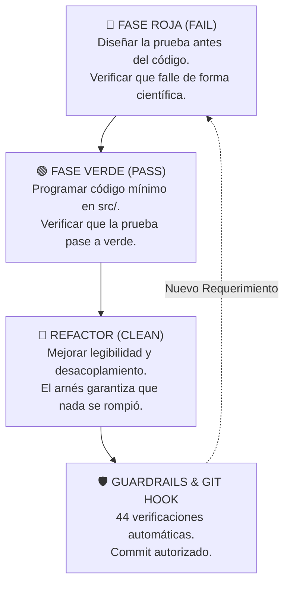
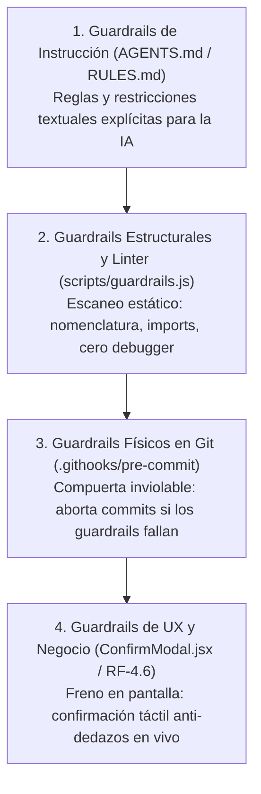
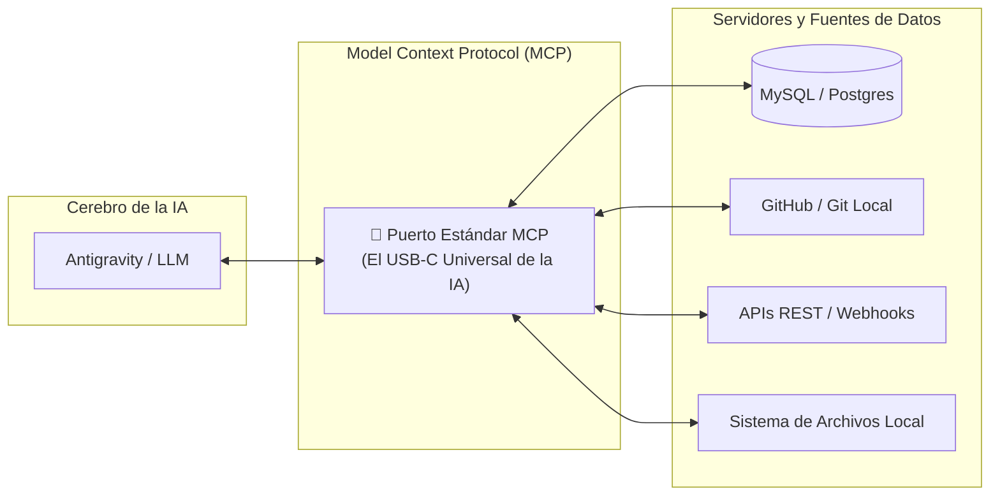
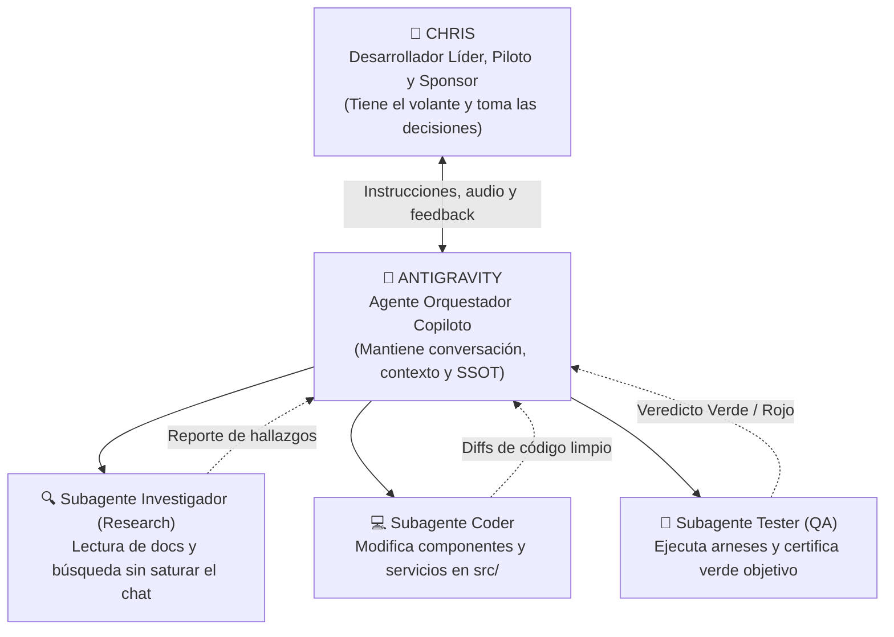
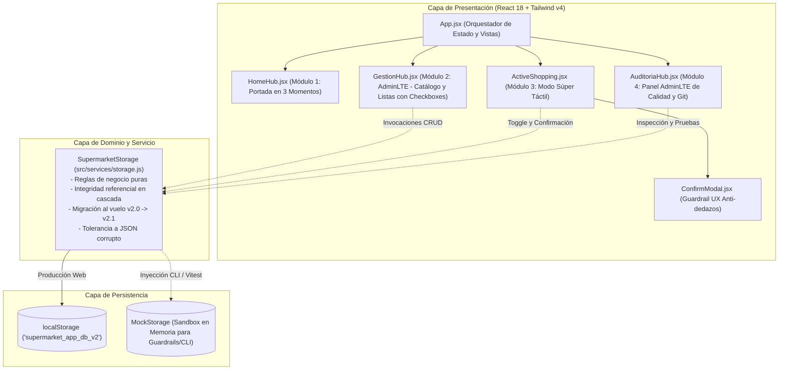
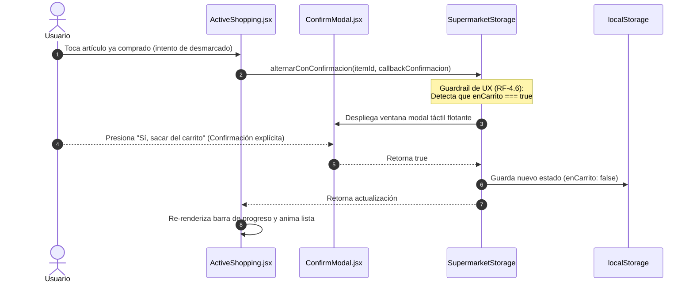
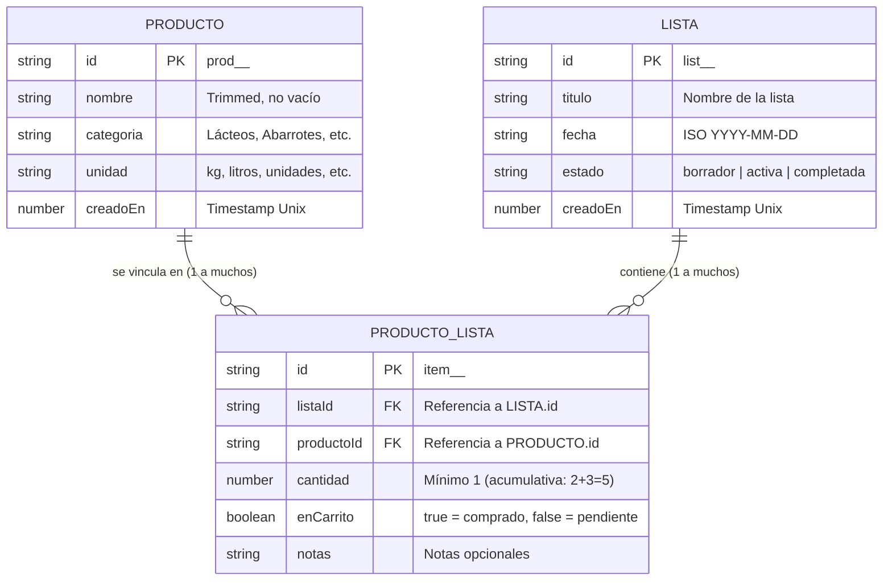
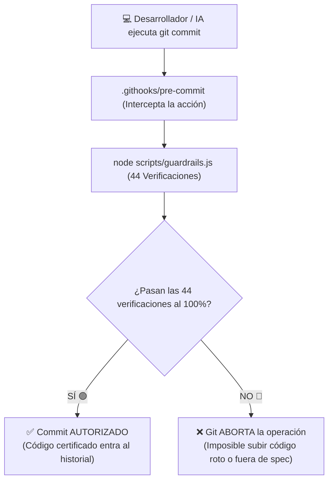
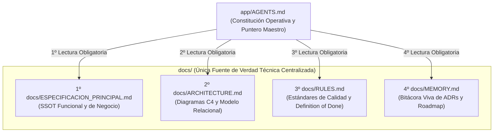

# Guía Maestra de Spec-Driven Development, Arneses, Agentes, Guardrails, Skills y MCP

> **Autor / Estudiante:** Christian Vargas A.  
> **Copiloto de IA:** Antigravity (Google DeepMind)  
> **Proyecto de Referencia:** SuperCarrito SDD  
> **Versión:** 3.5 Definitiva, Ilustrada con Diagramas y Banco Extendido de 20 Preguntas & Respuestas | Octubre 2026  
> **Ubicación:** `info-docs/GUIA_MAESTRA_SDD_AGENTES_ARNESES.md`

---

## 📑 Tabla de Contenidos

1. [¿Qué es Spec-Driven Development (SDD)?](#1-qué-es-spec-driven-development-sdd)
2. [El Arnés de Pruebas (Test Harness) - El Órgano Sensorial](#2-el-arnés-de-pruebas-test-harness---el-órgano-sensorial)
3. [El Ciclo de Vida: Rojo $\rightarrow$ Verde $\rightarrow$ Refactor](#3-el-ciclo-de-vida-rojo--verde--refactor)
4. [Guardrails: Las Barandillas de Seguridad (Explicado para Todos)](#4-guardrails-las-barandillas-de-seguridad-explicado-para-todos)
5. [Skills (Habilidades): La Carpeta de Especialidad de la IA](#5-skills-habilidades-la-carpeta-de-especialidad-de-la-ia)
6. [MCP (Model Context Protocol): El USB-C Universal de la IA](#6-mcp-model-context-protocol-el-usb-c-universal-de-la-ia)
7. [Arquitectura de Agentes, Subagentes y Slash Commands en Pair Programming](#7-arquitectura-de-agentes-subagentes-y-slash-commands-en-pair-programming)
8. [Matriz Comparativa y Diccionario Conceptual Rápido](#8-matriz-comparativa-y-diccionario-conceptual-rápido)
9. [Caso de Estudio Real: SuperCarrito SDD (Arquitectura Módulo a Módulo y Diagramas C4)](#9-caso-de-estudio-real-supercarrito-sdd-arquitectura-módulo-a-módulo-y-diagramas-c4)
10. [Checklist Profesional y Protocolo de Trabajo Definitivo](#10-checklist-profesional-y-protocolo-de-trabajo-definitivo)
11. [Preguntas y Respuestas Frecuentes (Banco Extendido de Repaso - 20 Consultas Clave)](#11-preguntas-y-respuestas-frecuentes-banco-extendido-de-repaso---20-consultas-clave)

---

## 1. ¿Qué es Spec-Driven Development (SDD)?

El **Desarrollo Guiado por Especificaciones (SDD)** es una metodología de ingeniería de software en la cual **una especificación viva, formal y versionada actúa como la Única Fuente de Verdad (Single Source of Truth - SSOT)** antes de escribir o modificar una sola línea de código de producción.

### 🏠 La Analogía de la Vida Real: El Plano del Arquitecto
Imagina que contratas a un equipo de constructores para levantar una casa de dos plantas. Si les dices: *"Constrúyanme una casa bonita y moderna"*, cada albañil construirá lo que imagine: uno pondrá una ventana donde el otro iba a pasar una tubería de agua, y el techo se vendrá abajo.  
En la construcción profesional, **nadie pega un solo ladrillo sin el plano aprobado por el arquitecto**. Si el cliente quiere mover una pared, primero se redibuja el plano, se calculan las vigas y luego se mueve el ladrillo.

### ⚠️ El Problema de Programar con IA sin Especificación
Cuando se le pide a una IA: *"Hazme una pantalla de compras"*, la IA responde basándose en probabilidades estadísticas y suposiciones. El resultado inevitable es:
- Nombres de campos inventados (`item_title` vs `name` vs `nombre`).
- Reglas de negocio cambiantes entre una respuesta y otra.
- Pérdida de integridad referencial entre tablas.
- **Alucinación técnica** acumulativa que destruye el código previo.

### 💎 La Regla de Oro del SDD
> **"El código siempre sigue a la especificación; la especificación NUNCA persigue al código."**



Si el sponsor pide un cambio de negocio (ej: confirmación anti-dedazos o nombres en español):
1. **Primero** se redacta en la especificación ([`app/docs/ESPECIFICACION_PRINCIPAL.md`](file:///c:/xampp/htdocs/Antigravity-sdd/app/docs/ESPECIFICACION_PRINCIPAL.md)).
2. **Segundo** se diseña la prueba en el arnés ([`app/tests/harness.html`](file:///c:/xampp/htdocs/Antigravity-sdd/app/tests/harness.html) o [`app/tests/e2e.test.jsx`](file:///c:/xampp/htdocs/Antigravity-sdd/app/tests/e2e.test.jsx)).
3. **Tercero** se implementa el código en producción ([`app/src/`](file:///c:/xampp/htdocs/Antigravity-sdd/app/src/)).

---

## 2. El Arnés de Pruebas (Test Harness) - El Órgano Sensorial

El **Arnés de Pruebas** es un banco de evaluación automatizado donde se colocan los componentes de software en condiciones controladas para verificar que cumplen matemáticamente las promesas hechas en la especificación.

### 👁️ El Órgano Sensorial del Agente de IA
- Los humanos tenemos ojos: abrimos el navegador, hacemos clics e inspeccionamos visualmente la interfaz.
- **La IA no tiene ojos humanos nativos.**
- El arnés actúa como su **órgano sensorial**: le permite saber con precisión matemática si su código compila, si cumple las aserciones o exactamente en qué línea falló.
- **Sin arnés:** La IA dice *"¡Listo, ya quedó!"* por corazonada o alucinación.
- **Con arnés:** La IA lee el fallo exacto (`"Expected true but received false"`), corrige el archivo específico y re-evalúa hasta alcanzar 100% verde.

### 🍽️ La Metáfora del Restaurante de Alta Cocina
| Componente | Rol en el Restaurante | Función en el Proyecto |
| :--- | :--- | :--- |
| **`ESPECIFICACION_PRINCIPAL.md`** | La Carta y la Receta Maestra | Define ingredientes, porciones y lo que el cliente pagó por recibir. |
| **`AGENTS.md` / `RULES.md`** | Normas de la Cocina | Reglas operativas y estándares que los cocineros (humanos e IA) deben obedecer. |
| **`tests/harness.html`** | El Inspector de Calidad | Prueba el plato antes de servirlo a la mesa. Si algo está crudo, rechaza la entrega. |
| **`MEMORY.md`** | La Bitácora del Chef | Anota lecciones aprendidas, incidentes y decisiones arquitectónicas (ADRs). |

---

## 3. El Ciclo de Vida: Rojo $\rightarrow$ Verde $\rightarrow$ Refactor



| Fase | Color | Acción | Propósito |
| :--- | :---: | :--- | :--- |
| **1. Fase Roja** | 🔴 FAIL | Diseñar la prueba antes de programar y verla fallar. | Demostrar científicamente que la prueba es sensible y detecta la ausencia de la función. |
| **2. Fase Verde** | 🟢 PASS | Programar el código mínimo necesario para pasar la prueba. | Cumplir estrictamente el contrato sin sobre-ingeniería. |
| **3. Refactor** | 🔵 CLEAN | Pulir código, estandarizar taxonomía y limpiar deuda técnica. | Mejorar la calidad y legibilidad sabiendo que el arnés te protege si algo se rompe. |

> [!WARNING]
> Si creas una prueba y pasa en verde de inmediato sin haber programado la función, **la prueba está mal diseñada (falso positivo)**. La Fase Roja es la validación científica de tu prueba.

---

## 4. Guardrails: Las Barandillas de Seguridad (Explicado para Todos)

La palabra **Guardrail** significa literalmente la **barandilla de contención** metálica que ves al borde de una carretera en la montaña o en un balcón alto.

Tú sabes manejar tu auto, pero si hay una curva peligrosa con neblina, hielo o te descuidas un segundo, la barandilla de acero **físicamente te impide caer al abismo**. No depende de tu fuerza de voluntad; la barandilla está ahí para frenar el desastre mecánicamente.

### 🚲 3 Ejemplos Visuales de la Vida Real:
1. **La puerta del microondas:** Si abres la puerta mientras calienta, el microondas **se apaga automáticamente en el milisegundo cero**. Es un guardrail físico: no confía en que tú recuerdes apagarlo; bloquea el peligro por diseño.
2. **Las ruedas de entrenamiento en la bicicleta infantil:** No pedalean por el niño, pero si la bicicleta se inclina peligrosamente hacia un costado, tocan el suelo y evitan una fractura.
3. **El enchufe eléctrico de 3 clavijas (con polo a tierra):** Tiene una clavija redonda más larga que las otras dos. Es imposible enchufarlo al revés; su propia geometría física actúa como guardrail.

### 🛡️ Los 4 Niveles de Guardrails en Desarrollo con IA:



---

## 5. Skills (Habilidades): La Carpeta de Especialidad de la IA

Imagina que contratas a un chef profesional muy inteligente. Sabe cocinar comida internacional, pero hoy tu restaurante va a abrir una estación de **Pastelería Francesa de Alta Precisión**.

El chef tiene la capacidad cerebral, pero para no cometer errores en las temperaturas del merengue, le entregas una **carpeta de especialidad** con las recetas exactas, las tablas de conversión de gramos a mililitros y la lista de fallos que jamás debe cometer. **Esa carpeta es un Skill.**

### ¿Qué es un Skill en Antigravity y Sistemas de IA?
- Es un paquete modular de instrucciones avanzadas, plantillas y herramientas que le enseñan a la IA **cómo realizar una tarea técnica específica al nivel de un experto**.
- **Ejemplos reales:**
  - `automation`: Instruye a la IA sobre cómo programar tareas periódicas (cron jobs).
  - `generative_ui`: Le enseña a la IA cómo generar interfaces interactivas y diagramas ricos dentro del chat.
  - `plugin`: Guía para empaquetar extensiones completas.
- **¿Para qué sirve?** Evita que la IA adivine o use métodos obsoletos; le da el manual oficial de procedimientos antes de empezar a trabajar.

---

## 6. MCP (Model Context Protocol): El USB-C Universal de la IA

Antes de que se inventara el estándar **USB-C**, conectar aparatos era una pesadilla: un teléfono usaba micro-USB, una cámara usaba mini-USB, un iPhone usaba Lightning y una impresora usaba USB tipo B. Había que comprar decenas de adaptadores incompatibles.

El **USB-C** resolvió esto unificando todo: **un solo conector estándar para cualquier dispositivo.**



### ¿Qué problema resuelve el MCP en la IA?
Históricamente, una IA es un cerebro aislado dentro de una ventana de texto. Si querías que la IA consultara tu base de datos de MySQL, tu cuenta de GitHub, tus archivos en Google Drive o tu servidor local, un programador tenía que escribir un código conector exclusivo y frágil para cada herramienta.

**MCP (Model Context Protocol) es el USB-C universal de la Inteligencia Artificial:**
- Es un protocolo estándar y abierto (creado por Anthropic y adoptado globalmente).
- Permite que cualquier sistema cree un "servidor MCP".
- La IA se "enchufa" a ese servidor con un protocolo común y puede leer datos o disparar acciones de forma segura y estandarizada, sin inventar conectores propietarios.

---

## 7. Arquitectura de Agentes, Subagentes y Slash Commands en Pair Programming



### 1. El Humano (Chris):
Tiene el volante y la visión estratégica. Define qué negocio queremos construir, aprueba la especificación y valida los resultados finales en pantalla y audio.

### 2. El Agente Orquestador (Antigravity):
Es el copiloto principal. Mantiene la conversación, coordina las fases de trabajo, actualiza la memoria viva (`docs/MEMORY.md`) y supervisa que no se rompan las reglas.

### 3. Los Subagentes:
Son agentes especializados que el orquestador puede despertar para tareas puntuales y aisladas sin saturar la ventana de contexto principal.

### 4. ¿Qué son los Slash Commands (Comandos con `/`)?
Son atajos rápidos que el usuario escribe en la caja de texto (como `/plan`, `/goal`, `/schedule` o comandos personalizados) para disparar flujos de trabajo predefinidos con una sola palabra clave.

---

## 8. Matriz Comparativa y Diccionario Conceptual Rápido

| Concepto | Analogía de la Vida Real | Función en el Proyecto SuperCarrito |
| :--- | :--- | :--- |
| **Spec-Driven Development (SDD)** | El plano del arquitecto antes de colocar ladrillos. | [`app/docs/ESPECIFICACION_PRINCIPAL.md`](file:///c:/xampp/htdocs/Antigravity-sdd/app/docs/ESPECIFICACION_PRINCIPAL.md) como Única Fuente de Verdad. |
| **Arnés de Pruebas (Harness)** | El banco de pruebas del laboratorio o el catador de cocina. | [`app/tests/harness.html`](file:///c:/xampp/htdocs/Antigravity-sdd/app/tests/harness.html) para validación sensorial objetiva (7/7 verde). |
| **Guardrails Duales (CLI + Web)** | La barandilla de la autopista y el tablero de control de mando. | [`app/scripts/guardrails.js`](file:///c:/xampp/htdocs/Antigravity-sdd/app/scripts/guardrails.js) en terminal y [`app/tests/guardrails.html`](file:///c:/xampp/htdocs/Antigravity-sdd/app/tests/guardrails.html) en navegador. |
| **Guardrail de Acero (Git)** | La barrera física de un peaje que no abre sin ticket. | `.githooks/pre-commit` impidiendo físicamente commits con guardrails rotos. |
| **Arnés Sensorial E2E** | El dedo del usuario tocando la pantalla real. | `tests/e2e.test.jsx` con Vitest y JSDOM simulando interacción física con el DOM. |
| **Patrón del Puntero Maestro** | El índice maestro de una biblioteca clasificada. | `AGENTS.md` en raíz guiando a agentes hacia la documentación en `docs/`. |
| **Skills** | La carpeta de recetas secretas del chef pastelero. | Conjuntos de instrucciones especializadas para capacitar a la IA en un tema. |
| **MCP** | El conector universal USB-C. | Protocolo estándar para conectar la IA a herramientas, APIs y bases de datos. |
| **Agente Orquestador** | El maestro de obras. | Antigravity conversando y guiando el proceso general del proyecto. |
| **Subagentes** | Los especialistas (el electricista, el fontanero). | Procesos paralelos delegados para tareas específicas de análisis o pruebas. |
| **ADR (Architecture Decision Record)** | El libro de actas de una junta directiva. | Registros numerados en [`docs/MEMORY.md`](file:///c:/xampp/htdocs/Antigravity-sdd/app/docs/MEMORY.md) (ADR-01 a ADR-17). |

---

## 9. Caso de Estudio Real: SuperCarrito SDD (Arquitectura Módulo a Módulo y Diagramas C4)

A lo largo del laboratorio, construimos una solución integral desacoplada en 3 capas bien definidas con flujo unidireccional:

### 📐 Diagrama de Capas del Sistema (C4 Component Diagram)



---

### Módulo 1: Portada y Navegación Minimalista ([`HomeHub.jsx`](file:///c:/xampp/htdocs/Antigravity-sdd/app/src/components/HomeHub.jsx) - RF-5.1 / RF-5.2)
- **Propósito:** Ofrecer una puerta de entrada táctil sin ruido visual, estructurada en los 3 momentos del usuario:
  - **Paso 1: Preparar la Compra (En casa):** Botón único de acción *"Gestionar"* para acceder al Catálogo y Listas.
  - **Paso 2: ¡Vamos al Súper! (En tienda):** Acceso directo al modo compra en vivo de la lista activa.
  - **Paso 3: Laboratorio SDD & Arneses:** Acceso al centro de control técnico y gobernanza de calidad.
- **Header Contextual:** En la portada solo conviven el logotipo y el selector de Modo Claro/Oscuro. En las vistas internas aparece el botón dinámico `← Volver al Inicio` con icono Home.

---

### Módulo 2: Centro Unificado de Gestión ([`GestionHub.jsx`](file:///c:/xampp/htdocs/Antigravity-sdd/app/src/components/GestionHub.jsx) - RF-5.4 / RF-5.5)
- **Estructura AdminLTE:** Disposición ergonómica en dos columnas:
  - **Panel Lateral (Sidebar):** Selector rápido entre la opción 1 (*"Catálogo de Despensa"*) y la opción 2 (*"Mantenimiento de Listas"*), acompañadas de insignias con los totales en tiempo real.
  - **Área de Trabajo Principal:** Muestra exclusivamente el subpanel seleccionado, optimizando el espacio en pantallas grandes.
- **Selector con Checkboxes y Carga en Lote (RF-3.1):** Reemplazo de las cajas de texto solitarias por un listado visual directo de productos con casillas de verificación, contador interactivo de seleccionados, botón *"Seleccionar todos"* y adición masiva en un solo clic.

---

### Módulo 3: Modo Compra Táctil con Confirmación Anti-dedazos ([`ActiveShopping.jsx`](file:///c:/xampp/htdocs/Antigravity-sdd/app/src/components/ActiveShopping.jsx) - RF-4.6)



- **Ergonomía de una Sola Mano:** A diferencia de las vistas administrativas, el Modo Súper adopta deliberadamente una columna vertical simple y ultra-limpia, diseñada para usarse caminando por los pasillos con el teléfono en una mano.
- **Modal Táctil ([`ConfirmModal.jsx`](file:///c:/xampp/htdocs/Antigravity-sdd/app/src/components/ConfirmModal.jsx)):** Se erradicó por completo el `window.confirm` nativo del navegador. La ventana modal flotante cuenta con botones grandes táctiles optimizados para el pulgar (`Sí, sacar del carrito` en rojo vs `No, mantener en carrito` en gris).

---

### 🗄️ Modelo de Datos Relacional y Reglas de Integridad



- **Borrado en Cascada (RF-2.4):** Si se elimina una Lista, se destruyen automáticamente sus ítems en `productos_listas`.
- **Preservación ante Desincorporación (RF-1.3):** Si se borra un producto del catálogo, las listas históricas no fallan con punteros nulos.
- **Acumulación de Cantidad (RF-3.2):** Si un producto ya estaba en la lista y se vuelve a agregar, no se duplica la fila; se incrementa la cantidad.

---

### 🛡️ Tolerancia a Fallos y Migración Silenciosa (RNF-02 / RNF-03)

```mermaid
flowchart TD
    START([Inicio obtenerBaseDeDatos]) --> CHECK_STORE{¿Existe valor en storage?}
    CHECK_STORE -- No --> SEED[Sembrar datos de demostración en español - RNF-04]
    CHECK_STORE -- Sí --> PARSE[Parsear JSON]
    
    PARSE --> VALID_JSON{¿JSON válido?}
    VALID_JSON -- Fallo (Corrupto) --> SAFE_RESET[Inicializar tablas limpias [] - RNF-02]
    
    VALID_JSON -- Éxito --> CHECK_LEGACY{¿Contiene claves en inglés?<br/>products / lists / items}
    CHECK_LEGACY -- Sí --> MIGRATE[Migración automática al vuelo v2.0 -> v2.1 - RNF-03]
    CHECK_LEGACY -- No --> RETURN[Retornar base de datos en español v2.2]
    
    MIGRATE --> SAVE_MIGRATED[Guardar estructura migrada] --> RETURN
    SAFE_RESET --> RETURN
    SEED --> RETURN
```

---

### Módulo 4: Centro Integrado de Auditoría SPA ([`AuditoriaHub.jsx`](file:///c:/xampp/htdocs/Antigravity-sdd/app/src/components/AuditoriaHub.jsx) - RF-5.3 / RF-5.6)
- Panel lateral AdminLTE de 4 opciones:
  1. **Auditar el Sistema:** Ejecución en vivo de los 44 Guardrails Maestros con barras de progreso y tarjetas por fase.
  2. **Ver Arnés Sensorial:** Banco de pruebas interactivo con los 7 contratos de dominio y tiempos de respuesta.
  3. **Guardrail de Acero (Git):** Tarjeta del último commit certificado, visor de código del hook pre-commit y consola interactiva con simulador de intercepciones y rechazos.
  4. **Arnés Sensorial E2E (Vitest):** Suite sensorial automatizada sobre el DOM, consola interactiva estilo terminal Vitest y desglose de los selectores DOM de los 6 flujos de usuario.



---

### Módulo 5: Patrón del Puntero Maestro y Consolidación de Documentación ([`AGENTS.md`](file:///c:/xampp/htdocs/Antigravity-sdd/app/AGENTS.md) - RF-5.7)



- En la raíz de `app/` únicamente permanece `AGENTS.md` (y el `README.md` estándar).
- Toda la base técnica reside clasificada y ordenada en [`app/docs/`](file:///c:/xampp/htdocs/Antigravity-sdd/app/docs/).
- `AGENTS.md` actúa como el índice maestro obligatorio que orienta a cualquier agente desde el primer segundo.

---

## 10. Checklist Profesional y Protocolo de Trabajo Definitivo

Cada vez que vayas a construir una nueva función en cualquier proyecto futuro:

```text
[ ] 1. Acordar el requerimiento de negocio con el sponsor / usuario.
[ ] 2. Redactar el requerimiento formal en docs/ESPECIFICACION_PRINCIPAL.md (subir versión SemVer).
[ ] 3. Escribir la prueba unitaria en tests/harness.html o tests/e2e.test.jsx con ID formal (RF-* / RNF-*).
[ ] 4. Ejecutar el arnés y verificar el FALLO CIENTÍFICO EN ROJO 🔴 (Fase Roja).
[ ] 5. Implementar el código mínimo en src/ hasta lograr ÉXITO EN VERDE 🟢 (Fase Verde).
[ ] 6. Ejecutar los guardrails automáticos en terminal (npm run check:guardrails) o panel web (AuditoriaHub).
[ ] 7. Registrar la decisión y lecciones aprendidas en docs/MEMORY.md (ADR).
[ ] 8. Ejecutar commit atómico en Git validado por el Pre-commit Hook siguiendo Conventional Commits.
```

---

## 11. Preguntas y Respuestas Frecuentes (Banco Extendido de Repaso - 20 Consultas Clave)

Compilación exhaustiva de las consultas reales planteadas por Chris durante nuestras sesiones de laboratorio, organizadas con explicaciones pedagógicas de alto valor técnico.

---

### ❓ P1: ¿Por qué no programamos directamente la interfaz o la base de datos en vez de escribir primero la especificación (`ESPECIFICACION_PRINCIPAL.md`)?
**Respuesta:**  
Porque programar sin especificación previa obliga a la IA (y a los desarrolladores) a **suponer y alucinar**. Cuando no existe un contrato formal con nombres exactos de campos, tipos de datos y reglas de negocio, la IA inventa estructuras sobre la marcha (por ejemplo, llamando a un campo `inCart` en un archivo y `comprado` en otro).  
Al redactar primero la especificación, se crea un contrato inmutable: **la Única Fuente de Verdad (SSOT)**. Cualquier función o componente que se escriba después tiene una referencia matemática contra la cual compararse. *El código siempre sigue a la especificación, la especificación jamás persigue al código*.

---

### ❓ P2: ¿Qué es exactamente el "Arnés de Pruebas" y por qué decimos que es el "órgano sensorial" de la Inteligencia Artificial?
**Respuesta:**  
Los humanos tenemos ojos: cuando cambiamos un botón en React, abrimos Chrome, hacemos clic y miramos si funcionó. La Inteligencia Artificial **no tiene ojos ni cuerpo físico**: si le pides un cambio sin un arnés, la IA no tiene forma de saber si su código compila o si rompió la persistencia; solo dice *"¡Listo, ya quedó!"* basándose en probabilidades.  
El **Arnés de Pruebas (Test Harness)** es su órgano sensorial: un entorno de ejecución automatizado que somete el código a pruebas matemáticas objetivas. Si algo falla, el arnés le entrega a la IA el mensaje exacto del error (*"Se esperaba que la cantidad fuera 5 pero se obtuvo 2"*). Con ese sentido de la vista artificial, la IA puede corregir con precisión quirúrgica hasta ver 100% verde.

---

### ❓ P3: ¿Por qué es tan importante la "Fase Roja" (Red Phase)? ¿No es una pérdida de tiempo ver fallar la prueba a propósito?
**Respuesta:**  
La Fase Roja es la **prueba de fuego científica** de tu arnés. Si escribes una prueba para una función que aún no existe y la prueba pasa en verde de inmediato, tu prueba no sirve: es un **falso positivo** que jamás te avisará cuando algo se rompa en producción.  
Ver la prueba fallar en rojo con el motivo exacto del fallo demuestra dos cosas fundamentales:
1. Que la prueba realmente está evaluando el comportamiento esperado.
2. Que cuando pase a verde más adelante, será legítimamente gracias al código que acabas de programar y no a una coincidencia.

---

### ❓ P4: ¿Qué es un Guardrail en ingeniería de software y en qué se diferencia de una prueba unitaria común?
**Respuesta:**  
Una prueba unitaria típica evalúa una función aislada (por ejemplo: `sumar(2, 3) === 5`).  
Un **Guardrail (Barandilla de Seguridad)** es una restricción arquitectónica global y preventiva que abarca múltiples capas del sistema:
- **Guardrails Estructurales:** Verifican que existan los archivos obligatorios (`docs/ESPECIFICACION_PRINCIPAL.md`, `docs/RULES.md`, etc.).
- **Guardrails Semánticos:** Comprueban que la especificación cumpla con el formato SemVer y contenga los requerimientos aprobados.
- **Guardrails de Linter de Dominio:** Escanean el código fuente para prohibir términos obsoletos en inglés, sentencias `debugger;` olvidadas o accesos directos indebidos de la UI a `localStorage`.
- **Guardrails de Ejecución:** Corren el arnés en memoria en menos de 50 milisegundos para certificar la integridad total antes de cualquier entrega.

---

### ❓ P5: ¿Por qué implementamos un "Guardrail de Acero" a nivel de Git Pre-commit Hook en lugar de confiar solo en el comando de npm?
**Respuesta:**  
Porque un script como `npm run check:guardrails` es solo una **sugerencia voluntaria**: si el desarrollador tiene prisa o la IA se salta un paso, cualquiera puede hacer `git commit` y subir código roto o fuera de especificación al repositorio remoto.  
Al instalar el hook en `.githooks/pre-commit` y activarlo con `git config core.hooksPath .githooks`, el guardrail se convierte en una **barrera física e inviolable**: cada vez que se teclea `git commit`, Git congela la operación y corre automáticamente los 44 guardrails maestros. Si una sola verificación falla, Git aborta físicamente el commit. Ningún código no certificado puede ingresar jamás al historial.

---

### ❓ P6: ¿Qué diferencia hay entre el Arnés de Pruebas en Memoria (`harness.html`) y el Arnés Sensorial E2E (`tests/e2e.test.jsx`) con Vitest?
**Respuesta:**  
- **El Arnés en Memoria ([`tests/harness.html`](file:///c:/xampp/htdocs/Antigravity-sdd/app/tests/harness.html)):** Evalúa directamente las funciones del servicio de almacenamiento (`storage.js`). Valida la lógica de negocio pura (que 2 + 3 sea 5, que el JSON corrupto se limpie, que el borrado en cascada funcione).
- **El Arnés Sensorial E2E ([`tests/e2e.test.jsx`](file:///c:/xampp/htdocs/Antigravity-sdd/app/tests/e2e.test.jsx)):** Monta el árbol completo de componentes React sobre un DOM virtual (JSDOM) y simula el **dedo físico del usuario**: hace clics en botones, marca casillas de verificación, abre ventanas modales, cambia de vistas y conmuta el tema claro/oscuro.  
El arnés E2E garantiza que no solo la lógica interna sea correcta, sino que los botones e interfaces que el usuario ve y toca respondan exactamente como exige la especificación.

---

### ❓ P7: ¿Por qué cambiamos el `window.confirm` nativo del navegador por un modal táctil personalizado (`ConfirmModal.jsx`) para la regla anti-dedazos?
**Respuesta:**  
El diálogo `window.confirm` nativo de los navegadores tiene graves deficiencias en aplicaciones modernas:
1. **Rompe la inmersión visual:** Muestra un cuadro gris genérico del sistema operativo que no respeta el tema claro ni oscuro.
2. **Bloquea el hilo principal de JavaScript:** Congela toda la pantalla hasta que se responde.
3. **Pésima ergonomía táctil en móviles:** Los botones son diminutos y están ubicados en la parte superior del navegador, imposibles de alcanzar cómodamente con el pulgar mientras caminas por el pasillo del supermercado.  
Al crear [`ConfirmModal.jsx`](file:///c:/xampp/htdocs/Antigravity-sdd/app/src/components/ConfirmModal.jsx), obtuvimos una ventana modal de alto contraste con botones grandes y amigables para el pulgar (`Sí, sacar del carrito` en rojo y `No, mantener en carrito` en gris), perfectamente integrada al diseño Tailwind y con soporte táctil inmediato.

---

### ❓ P8: ¿Por qué usamos navegación lateral AdminLTE en Paso 1 y Paso 3, pero una sola columna vertical en Paso 2 (Modo Súper)?
**Respuesta:**  
Por una razón fundamental de **ergonomía contextual y momentos de usuario (UX)**:
- **Paso 1 (Gestión) y Paso 3 (Auditoría):** Son tareas administrativas que el usuario realiza sentado en casa o frente a su computadora. Aquí hay espacio suficiente para un panel lateral de navegación estilo AdminLTE con opciones, contadores e insignias numéricas, permitiendo alternar rápidamente entre catálogos, listas y consolas técnicas.
- **Paso 2 (¡Vamos al Súper!):** Ocurre físicamente dentro de una tienda o supermercado. El usuario lleva el carrito con una mano y el teléfono con la otra. Obligarlo a lidiar con barras laterales o menús complejos causaría tropiezos y frustración. Por eso, el Paso 2 se diseñó deliberadamente como una lista vertical ultra-limpia de una sola columna, con casillas gigantes para marcar productos con el pulgar.

---

### ❓ P9: ¿Qué es el "Patrón del Puntero Maestro" (`Master Pointer Pattern`) y por qué dejamos solo `AGENTS.md` en la raíz y movimos los demás Markdown a `docs/`?
**Respuesta:**  
Tener múltiples archivos Markdown sueltos en la raíz (`SPEC.md`, `MEMORY.md`, `RULES.md`, `ARCHITECTURE.md`, `README.md`, etc.) genera desorden cognitivo tanto para los desarrolladores humanos como para las herramientas de IA, saturando la vista principal del proyecto.  
El **Patrón del Puntero Maestro** resuelve esto con una jerarquía limpia:
1. En la raíz solo queda **`AGENTS.md`** actuando como la **Constitución Operativa** y el mapa de orientación principal.
2. Toda la base de conocimiento técnico detallado se consolida dentro del subdirectorio [`docs/`](file:///c:/xampp/htdocs/Antigravity-sdd/app/docs/).
3. `AGENTS.md` contiene una tabla de enrutamiento obligatoria que le indica a cualquier agente nuevo exactamente en qué orden debe consultar los documentos al iniciar sesión: 1º Especificación (SSOT) $\rightarrow$ 2º Arquitectura $\rightarrow$ 3º Reglas $\rightarrow$ 4º Memoria viva.

---

### ❓ P10: ¿Qué es un Skill, qué es el protocolo MCP y cómo interactúan con los agentes y subagentes en una sesión de Pair Programming?
**Respuesta:**  
- **Skill (Habilidad):** Es un conjunto empaquetado de instrucciones y procedimientos especializados (como la carpeta de recetas de un chef) que le enseña a la IA cómo resolver una tarea técnica concreta (por ejemplo, cómo crear componentes visuales interactivos con `generative_ui` o cómo diseñar automatizaciones).
- **MCP (Model Context Protocol):** Es el estándar universal (el "USB-C de la IA") que permite a la IA conectarse con seguridad a herramientas externas, bases de datos o servicios de Git mediante un protocolo estandarizado, sin requerir adaptadores propietarios.
- **Agentes y Subagentes:** El agente principal (Antigravity) coordina la conversación con el humano (Chris) y, cuando se requiere una tarea pesada o especializada (como correr pruebas o investigar librerías), despierta subagentes específicos en segundo plano. Esto mantiene el hilo principal limpio, enfocado y libre de ruido.

---

### ❓ P11: ¿Qué es un ADR (Architecture Decision Record) y por qué los registramos en `docs/MEMORY.md`?
**Respuesta:**  
Un **ADR (Registro de Decisión Arquitectónica)** es un documento breve y fechado que registra una decisión técnica importante, el contexto que la motivó, las alternativas consideradas y sus consecuencias.  
En el desarrollo de software convencional, los equipos cambian arquitecturas y meses después nadie recuerda *por qué* se tomó una decisión. Al registrar cada decisión numerada (`ADR-01` a `ADR-17`) en [`docs/MEMORY.md`](file:///c:/xampp/htdocs/Antigravity-sdd/app/docs/MEMORY.md), creamos una memoria histórica viva que evita que el equipo o la IA repitan errores del pasado o deshagan decisiones previamente aprobadas por el sponsor.

---

### ❓ P12: ¿Qué es la "Definición de Terminado" (Definition of Done - DoD) en un flujo SDD profesional?
**Respuesta:**  
En SDD, una funcionalidad **NO está terminada** simplemente porque *"el código ya compila"* o *"se ve bien en pantalla"*.  
Según nuestro [`docs/RULES.md`](file:///c:/xampp/htdocs/Antigravity-sdd/app/docs/RULES.md), una tarea solo se considera formalmente **COMPLETADA** cuando cumple con la lista de verificación completa:
1. **Spec:** El requerimiento tiene código formal (`RF-*` / `RNF-*`) en `docs/ESPECIFICACION_PRINCIPAL.md`.
2. **Harness:** Existe una prueba en el arnés correspondiente.
3. **Fase Roja superada:** Se verificó que la prueba fallaba antes de escribir la solución.
4. **Arnés en Verde:** 100% de las pruebas pasan con éxito.
5. **Guardrails en Verde:** 44/44 guardrails pasan en verde en terminal y el Git Pre-commit Hook autoriza la confirmación.
6. **ADR y Memoria:** La decisión y lecciones aprendidas quedan asentadas en `docs/MEMORY.md`.

---

### ❓ P13: ¿Cómo garantizamos la resiliencia y tolerancia a fallos si el `localStorage` contiene JSON corrupto o caracteres extraños (RNF-02)?
**Respuesta:**  
Implementamos un bloque `try/catch` defensivo dentro de `obtenerBaseDeDatos()` en [`storage.js`](file:///c:/xampp/htdocs/Antigravity-sdd/app/src/services/storage.js). Si un usuario o una extensión del navegador inyecta texto malformado (ej: `"{corrupto: true...`), el método no permite que la aplicación colapse en pantalla blanca. En su lugar, detecta la excepción, inicializa silenciosamente una estructura limpia con tablas vacías (`{ productos: [], listas: [], productos_listas: [] }`) y guarda ese estado recuperado, protegiendo al usuario en el 100% de los casos.

---

### ❓ P14: ¿Cómo funciona la migración automática de datos existentes cuando cambiamos el idioma del dominio de inglés a español sin perder nada (RNF-03)?
**Respuesta:**  
Mediante un motor de migración transparente al vuelo dentro de `obtenerBaseDeDatos()`. Al leer la información guardada, el servicio verifica si existen claves heredadas en inglés (`data.products`, `data.lists`, `data.items`).  
Si las encuentra, mapea cada entidad al nuevo esquema en español (`productos`, `listas`, `productos_listas`), traduce los nombres de campos (ej: `inCart` $\rightarrow$ `enCarrito`), elimina las propiedades obsoletas, guarda la estructura modernizada en `localStorage` y la retorna. El usuario ni siquiera se da cuenta de que ocurrió una migración de esquema y preserva todas sus listas intactas.

---

### ❓ P15: ¿Por qué es una regla innegociable prohibir que los componentes React accedan directamente a `localStorage` (Aislamiento de Persistencia)?
**Respuesta:**  
Si cada componente React (`ProductCatalog.jsx`, `ListManager.jsx`, etc.) hiciera `localStorage.getItem()` o `localStorage.setItem()` por su cuenta:
1. El código estaría fuertemente acoplado al navegador, imposibilitando correr pruebas automatizadas o guardrails en Node.js sin navegador.
2. Las reglas de negocio (como no duplicar productos o borrar en cascada) tendrían que repetirse en cada pantalla, generando inconsistencias y bugs.  
Al canalizar toda lectura y escritura a través de [`SupermarketStorage`](file:///c:/xampp/htdocs/Antigravity-sdd/app/src/services/storage.js), la UI solo se encarga de pintar la pantalla y el servicio se encarga de la lógica y la persistencia. La Fase 4 de nuestros guardrails escanea el código y falla si algún archivo de `src/components/` invoca `localStorage` directamente.

---

### ❓ P16: ¿Por qué reemplazamos la entrada de texto tradicional por un catálogo con casillas de verificación (checkboxes) y carga en lote al armar una lista (RF-3.1)?
**Respuesta:**  
Escribir manualmente el nombre de los productos una y otra vez cada semana es lento y propenso a errores tipográficos (un día escribes *"Manzanas"*, otro *"Manzana roja"* y otro *"manzanas"*).  
Con el selector con casillas de verificación, el usuario ve de inmediato todos los productos que ya tiene en su despensa, marca con un toque los 5 o 10 que necesita esta semana y presiona *"Agregar productos seleccionados"*. El sistema los procesa en lote, acumulando cantidades si alguno ya estaba en la lista, ahorrando tiempo y asegurando una taxonomía limpia.

---

### ❓ P17: ¿Por qué integramos el Centro de Auditoría (Guardrails, Arneses y Git) directamente dentro de la SPA en vez de dejarlo como comandos de consola aislados?
**Respuesta:**  
Porque una de las premisas del **Laboratorio SDD** es la democratización visual de la ingeniería de calidad. Dejar los guardrails únicamente en la terminal de Node.js limita su visibilidad al desarrollador técnico.  
Al integrarlo en [`AuditoriaHub.jsx`](file:///c:/xampp/htdocs/Antigravity-sdd/app/src/components/AuditoriaHub.jsx) dentro de la propia aplicación web, cualquier miembro del equipo, cliente o evaluador puede abrir la pestaña de Auditoría, hacer clic en *"Re-ejecutar Guardrails"* o *"Ejecutar Suite E2E"*, y ver en vivo cómo se evalúan las 44 reglas, inspeccionar los selectores del DOM y comprobar el commit certificado por Git sin necesidad de abrir una consola de comandos.

---

### ❓ P18: ¿Cómo se configuran los ganchos de Git mediante `.githooks` y el comando `core.hooksPath` para que funcionen automáticamente en cualquier equipo?
**Respuesta:**  
Por defecto, Git busca los hooks dentro de la carpeta oculta `.git/hooks/`, la cual **no se sincroniza en los repositorios remotos**. Esto provoca que un hook programado en una máquina se pierda cuando otro desarrollador clona el proyecto.  
Para resolver esto de forma profesional:
1. Creamos una carpeta visible versionada en Git llamada [`.githooks/`](file:///c:/xampp/htdocs/Antigravity-sdd/.githooks/) que contiene el archivo ejecutable `pre-commit`.
2. Configuramos el comando `npm run setup:hooks` que ejecuta `git config core.hooksPath .githooks`.  
De esta manera, Git sabe que debe buscar los hooks en esa carpeta versionada, garantizando que el "Guardrail de Acero" viaje con el código fuente y proteja el repositorio en cualquier máquina donde se trabaje.

---

### ❓ P19: ¿Cómo ejecuta Vitest con Testing Library y JSDOM las pruebas E2E en apenas 1.8 segundos sin levantar navegadores pesados tipo Selenium o Cypress?
**Respuesta:**  
Herramientas como Cypress o Selenium levantan instancias completas de Google Chrome o Firefox en segundo plano, consumiendo cientos de megabytes de memoria y tardando entre 15 y 45 segundos por corrida.  
**Vitest + JSDOM** simulan el árbol completo de la API del DOM (`document`, `window`, eventos táctiles y clics) puramente en memoria dentro de Node.js. Al combinarse con React Testing Library, renderizan los componentes reales de React y ejecutan las interacciones del usuario en milisegundos, permitiendo verificar los 6 flujos E2E de inicio a fin en menos de 2 segundos.

---

### ❓ P20: ¿Por qué estructuramos la aplicación completa en torno al flujo cronológico del usuario en 3 momentos de vida (En casa $\rightarrow$ En tienda $\rightarrow$ En laboratorio)?
**Respuesta:**  
Muchas aplicaciones fracasan porque imitan la estructura de sus tablas de base de datos en lugar del flujo mental de las personas.  
Una persona no piensa en *"Entidades y Relaciones"*; su vida se organiza cronológicamente:
1. **Momento 1 (En casa antes de salir):** Reviso qué me falta en la despensa y armo mi lista de compras (**Paso 1: Gestionar**).
2. **Momento 2 (En el supermercado):** Entro a la tienda, camino por los pasillos con el carrito y marco los productos que voy metiendo (**Paso 2: ¡Vamos al Súper!**).
3. **Momento 3 (En la oficina técnica / Laboratorio):** Reviso la salud del software, los guardrails y la integridad del sistema (**Paso 3: Laboratorio SDD & Arneses**).  
Diseñar la portada ([`HomeHub.jsx`](file:///c:/xampp/htdocs/Antigravity-sdd/app/src/components/HomeHub.jsx)) y la navegación respetando estos 3 momentos elimina la fricción cognitiva y ofrece una experiencia de usuario natural e intuitiva.
